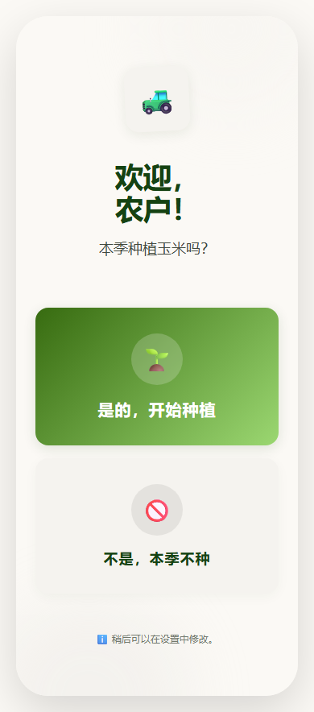
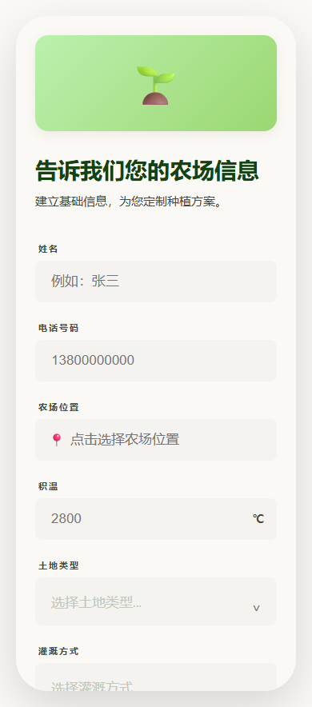
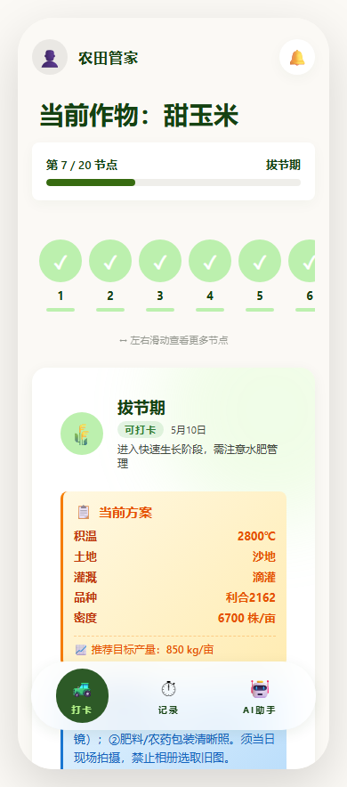
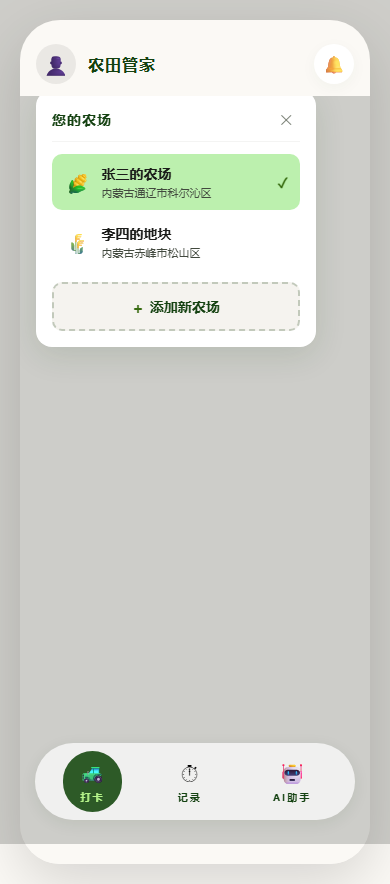
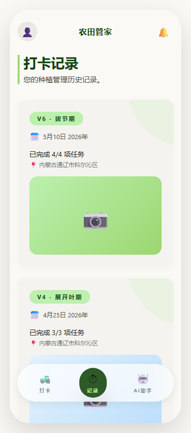
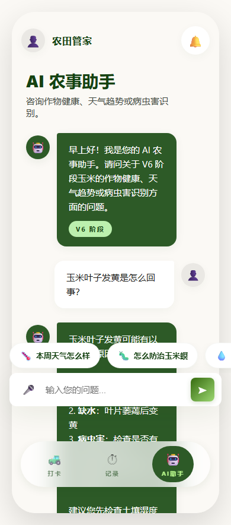

# Farm Manager (The Living Ledger)

[](./README.md)

A WeChat Mini Program for corn farming management, built on WeChat Cloud Development. It provides farm setup, growth stage task management, daily check-ins, and AI-powered agricultural consulting.

## Features

- **Farm Management**: Create and manage multiple farms with crop type, planting area, and location
- **Growth Stage Tracking**: Push farming tasks based on corn growth stages (VE → R1)
- **Check-in & Logs**: Daily farming operation check-ins with text and photo records
- **AI Farming Assistant**: Integrated with Tencent Yuanqi AI agent for pest identification, fertilization advice, and weather alerts
- **Multimedia Records**: Upload field photos and generate temporary access links
- **Subscription Messages**: Push notifications for key farming milestones

## Tech Stack

- **Frontend**: WeChat Mini Program Native (WXML / WXSS / JS)
- **Backend**: WeChat Cloud Development (CloudBase)
- **Cloud Functions**: Node.js + wx-server-sdk
- **Database**: Cloud Development JSON Database
- **AI Service**: Tencent Yuanqi OpenAPI

## Prerequisites

1. [Register a WeChat Mini Program account](https://mp.weixin.qq.com/)
2. Enable **WeChat Cloud Development** and note your **Cloud Environment ID**
3. (Optional) Register at [Tencent Yuanqi](https://yuanqi.tencent.com/) and publish an agent to get the **Assistant ID** and **Token**

## Quick Start

### 1. Clone the project

```bash
git clone https://github.com/784228565/WeChat-corn-grow-helper-miniprogram.git
cd WeChat-corn-grow-helper-miniprogram
```

### 2. Configure AppID

Open `project.config.json` and fill in your Mini Program AppID:

```json
{
  "appid": "wx1234567890abcdef"
}
```

> Get your AppID from WeChat Official Platform → Development → Development Settings.

### 3. Open with WeChat DevTools

1. Download and install [WeChat DevTools](https://developers.weixin.qq.com/miniprogram/dev/devtools/download.html)
2. Select "Import Project" and point to the project root
3. Enter your AppID in the popup and check "Use Cloud Development"
4. Click "Cloud Development" in the top-right corner of DevTools to confirm the environment

### 4. Configure Cloud Function Environment Variables

Go to **WeChat DevTools → Cloud Development Console → Cloud Functions → Versions & Config → Environment Variables**, and add the following:

#### All business cloud functions (7 total)

For `loginManager`, `checkinManager`, `farmManager`, `taskManager`, `mediaManager`, `aiAssistant`, `subscribeManager`:

| Variable | Description | Example |
|----------|-------------|---------|
| `TOKEN_SECRET` | Token signing key, **must be consistent across all functions** | `your-random-secret-key-min-32-chars` |

> **Security tip**: Generate a random string of at least 32 characters using `node -e "console.log(require('crypto').randomBytes(32).toString('hex'))"`. Never commit secrets to the repository.

#### aiAssistant cloud function (additional)

| Variable | Description | How to get |
|----------|-------------|------------|
| `YUANQI_TOKEN` | Tencent Yuanqi API Token | Yuanqi publish page → API Access → Copy Token |

To change the agent ID, edit `ASSISTANT_ID` in `cloudfunctions/aiAssistant/config/index.js`.

### 5. Initialize Database

1. In DevTools, right-click `cloudfunctions/initDatabase` → "Create and Deploy: Install dependencies in cloud"
2. After deployment, right-click again → "Upload and Deploy" (skip if already deployed)
3. In "Cloud Development Console → Database", confirm the following collections exist:
   - `Farms`
   - `Users`
   - `Tasks`
   - `TaskTemplates`
   - `CheckIns`
   - `MediaRecords`
   - `sys_config`

> If collections are not auto-created, manually create them in the console.

### 6. Configure Database Secret (Recommended)

For enhanced security, create a document with `_id: "auth"` in the `sys_config` collection:

```json
{
  "_id": "auth",
  "tokenSecret": "same value as TOKEN_SECRET environment variable"
}
```

`loginManager` and `aiAssistant` will read the key from the database first, supporting hot updates without redeployment.

### 7. Deploy all cloud functions

In DevTools, right-click each of the following cloud functions → "Upload and Deploy: Install dependencies in cloud":

- `loginManager`
- `checkinManager`
- `farmManager`
- `taskManager`
- `mediaManager`
- `aiAssistant`
- `subscribeManager`

### 8. Run the project

Click the "Compile" button in WeChat DevTools to preview the Mini Program in the simulator.

On first launch, silent login is triggered automatically. New users will be redirected to the farm setup page.

## Screenshots

| Welcome | Farm Setup | Daily Check-in |
|---------|-----------|----------------|
|  |  |  |

| Farm Menu | Logs | AI Assistant |
|-----------|------|--------------|
|  |  |  |

## Project Structure

```
.
├── app.js                  # Mini Program entry, cloud init, auth management
├── app.json                # Global pages and window config
├── app.wxss                # Global styles
├── project.config.json     # Project config (fill in your AppID)
├── sitemap.json            # Sitemap for search indexing
│
├── pages/                  # Mini Program pages
│   ├── welcome/            # Welcome page
│   ├── setup/              # Farm initialization
│   ├── checkin/            # Daily check-in home
│   ├── logs/               # Check-in history
│   ├── ai/                 # AI farming assistant
│   └── notcorn/            # Non-corn crop hint page
│
├── cloudfunctions/         # Cloud functions
│   ├── loginManager/       # User login & Token management
│   ├── farmManager/        # Farm CRUD
│   ├── taskManager/        # Tasks & growth stage management
│   ├── checkinManager/     # Check-in submit & query
│   ├── mediaManager/       # Image upload & temp links
│   ├── aiAssistant/        # Tencent Yuanqi AI proxy
│   ├── subscribeManager/   # Subscription message push
│   └── initDatabase/       # Database initialization (one-time)
│
├── utils/                  # Frontend utilities
│   └── request.js          # Unified request interceptor (auto-inject Token)
│
└── docs/                   # Project docs & design drafts
```

## FAQ

### Q1: "TOKEN_SECRET not configured" error

Make sure `TOKEN_SECRET` is set in the Cloud Development Console for the corresponding cloud function, and the function has been redeployed. Environment variable changes require redeployment to take effect.

### Q2: AI assistant returns "config error" or no response

Check:
1. Whether `YUANQI_TOKEN` is set for the `aiAssistant` cloud function
2. Whether `ASSISTANT_ID` matches your published agent ID
3. Whether the agent is published on the Tencent Yuanqi platform (unpublished agents cannot be called)

### Q3: Cloud function call returns "errCode: -501000"

Usually indicates the cloud development environment is not initialized correctly. Check:
1. Whether the correct cloud development environment is selected in DevTools
2. Whether `wx.cloud.init` in `app.js` executes successfully
3. Whether the cloud function is correctly deployed to the current environment

### Q4: Database collections not created

WeChat Cloud Development collections are not auto-created (except on first write inside a cloud function). If `initDatabase` fails, manually create the required collections in the console.

### Q5: How to switch to another AI provider?

The AI conversation logic is encapsulated in `cloudfunctions/aiAssistant/index.js`. To integrate other LLMs (e.g., OpenAI, Ernie), replace the request logic in this cloud function; the frontend does not need modification.

## Contributing

Issues and Pull Requests are welcome. Before submitting, please ensure:

1. Do not commit any code containing real AppID, Token, or secrets
2. Cloud function configs should read from `process.env` for environment variables
3. Update relevant docs (e.g., if changing database structure, sync updates here)

## License

MIT License
